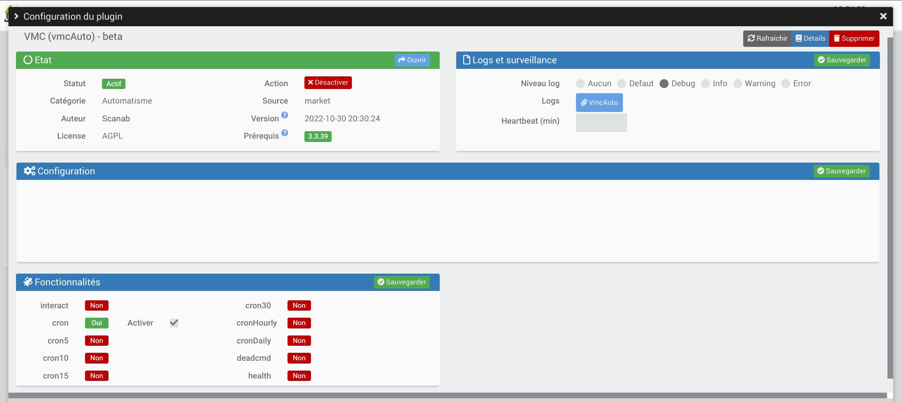
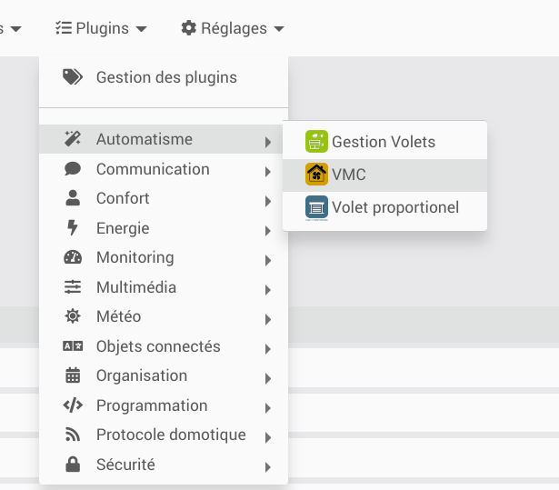
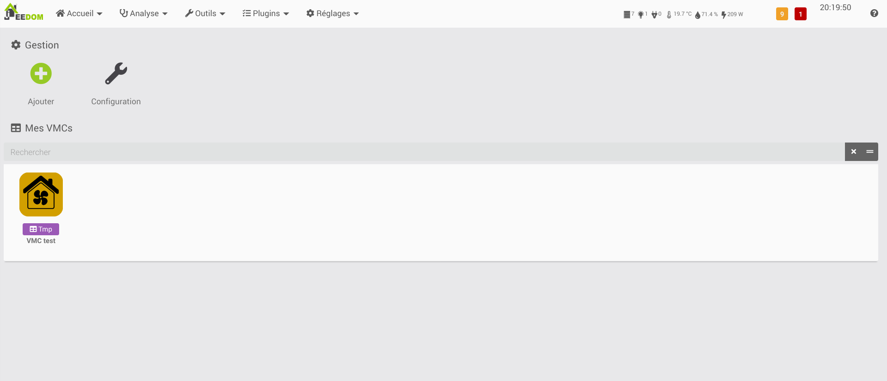
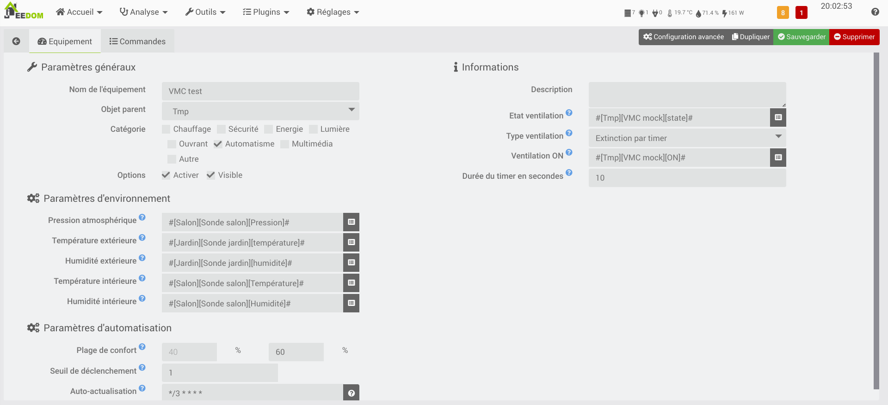

# Plugin VMC Auto

Ce plugin permet la gestion de la vitesse d'une VMC en fonction de la pression athmosphérique, de la températures et du taux d'humidité.
Le plugin calcule la concentration (en g/m3) d'eau dans l'air extérieur et la compare à celle de l'air intérieur afin de savoir si il faut déclencher la ventilation.
Le plugin fonctionne idéalement avec une VMC commandable par Jeedom, mais peut aussi servir pour déclencher des alertes demandant d'aérer (cf. doc).

Le strict minimum pour fonctionner est la présence d'un capteur de température est d'humidité intérieure. Les capteurs de température/humidité extérieure ainsi que celui de pression atmosphérique peuvent être remplacés par le plugin weather.

# Configuration du plugin

Après téléchargement du plugin, il suffit juste d’activer celui-ci, il n’y a aucune configuration à ce niveau.

# Configuration des équipements

La configuration des équipements vmcAuto est accessible à partir du menu plugin :

Voilà à quoi ressemble la page du plugin Networks (ici avec déjà 1 équipement) :

Une fois que vous cliquez sur l’un d’eux, vous obtenez :

Vous retrouvez ici toute la configuration de votre équipement :

-   **Nom de l’équipement** : nom de votre équipement vmcAuto,
-   **Objet parent** : indique l’objet parent auquel appartient l’équipement,
-   **Catégorie** : les catégories de l’équipement (il peut appartenir à plusieurs catégories),
-   **Activer** : permet de rendre votre équipement actif,
-   **Visible** : rend votre équipement visible sur le Dashboard,
-   **Pression Atmosphérique** : commande permettant d'obtenir la pression atmosphérique,
-   **Température extérieure** : commande permettant d'obtenir la température extérieure,
-   **Humidité extérieure** : commande permettant d'obtenir l'humidité extérieure,
-   **Température intérieure** : commande permettant d'obtenir la température intérieure,
-   **Humidité intérieure** : commande permettant d'obtenir l'humidité intérieure,
-   **Plage de confort** (optionnel - défaut : [40;70]) : La plage de confort d'hygrométrie que vous souhaitez,
-   **Seuil de déclenchement** (optionnel - défaut : 5) : Le nombre de % d'écart entre l'hygrométrie désirée et l'hygrométrie théorique accessible permettant de déclencher la ventilation,
-   **Auto-actualisation** : cron définissant la fréquence d'actualisation,
-   **Etat ventilation** (optionnel) : commande binaire permettant d'obtenir l'état actuel de la ventilation,
-   **Ventilation ON** : comande action permettant de lancer la ventilation,
-   **Type de ventilation** : soit la ventilation est lancée et s'arrête toute seule au bout d'un temps donné, soit elle doit être arrêté via une commande,
-   **Durée du timer** (uniquement si le type d'arrêt de la ventilation est un timer) (optionnel) : la durée du timer. Uniquement informatif,
-   **Ventilation OFF** (uniquement si le type d'arrêt de la ventilation est une commande) : comande action permettant d'arrêter la ventilation.

Dans l'onglet commande, vous retrouvez la liste des commandes créées automatiquement pour votre équipement :

-   **Rafraichir** : action permettant de relancer les calcul sans attendre le cron,
-   **Activer automatisme** : action permettant d'activer l'automatisme. Permet de définir des scénarios permettant d'activer/désactiver la gestion automatique de la ventilation par exemple en cas de grand froid ou d'absence,
-   **Désctiver automatisme** : action permettant de désactiver l'automatisme. Permet de définir des scénarios permettant d'activer/désactiver la gestion automatique de la ventilation par exemple en cas de grand froid ou d'absence,
-   **Etat automatisme** : info binaire indiquant si l'automatisme est activé actuellement,
-   **Concentration H2O extérieur** : info numérique indiquant la concentration en grammmes d'eau par m3 d'air extérieur,
-   **Concentration H2O intérieur** : info numérique indiquant la concentration en grammmes d'eau par m3 d'air intérieur,
-   **Humidité intérieure théorique accessible** : info numérique indiquant le taux d'humidité calculé si l'air extérieur était mis à la température de l'air intérieur,
-   **Régulation en cours** : info binaire indiquant si l'equipement a déclenché la ventilation.

# Tips

## Alerte aération

Si votre Jeedom n'est pas en mesure de controler votre VMC, vous pouvez utiliser ce plugin afin de définir une alerte demandant d'aérer. Il faut pour cela :

-   définir un virtuel "aération" (avec deux actions on et off mettant à jour une info binaire d'état) qui remplacera la VMC dans le plugin.
-   définir un scénario dont le déclencheur est l'état du virtuel précédement créé, et qui selon la valeur de celui-ci lance les alertes

> **Note**
> L'auteur de ce plugin ne garantit pas la justesse des conversions. Il n'est pas responsable d'un dommage causé par un résultat faux.